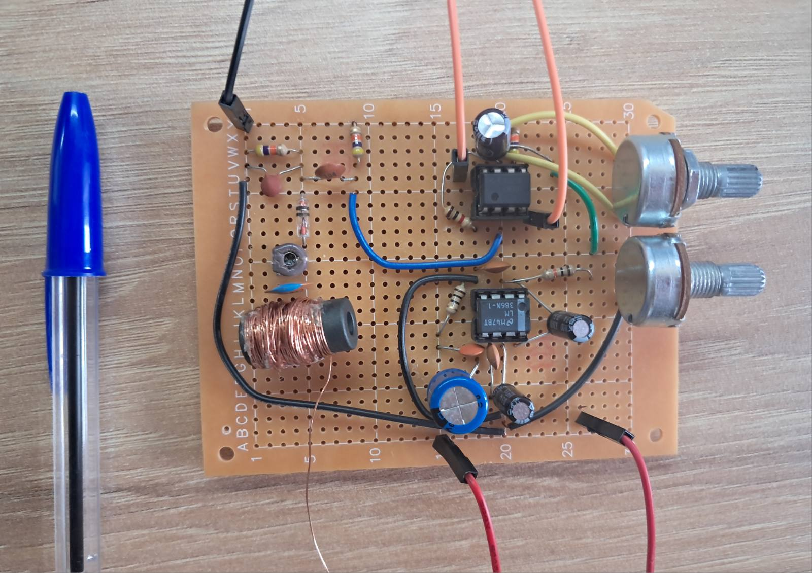
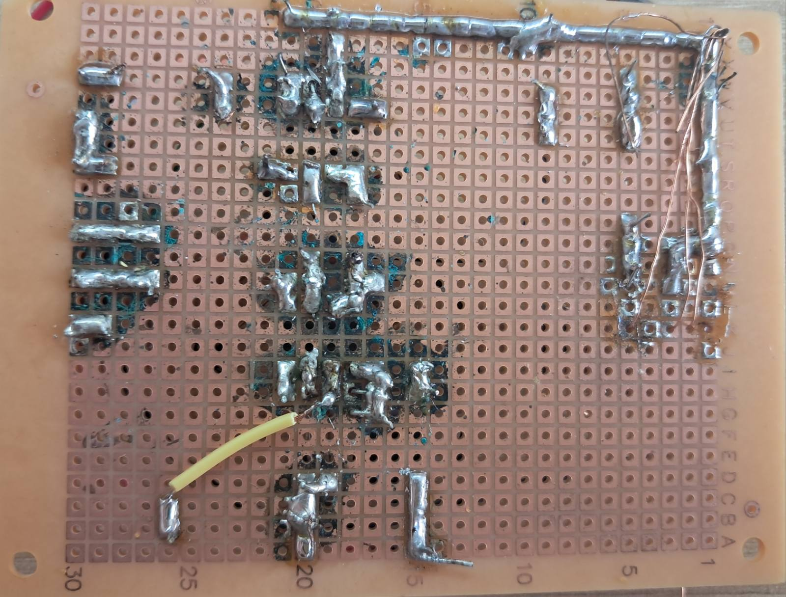
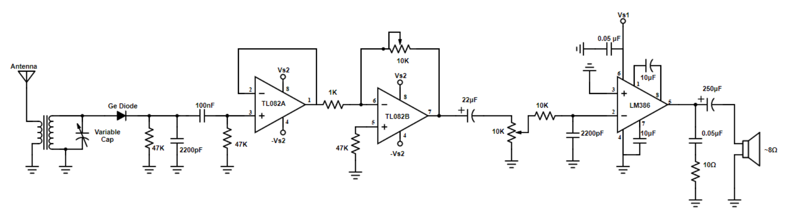

# 📻 Analog AM Radio Receiver (Full Build)

A complete AM radio receiver project, built from scratch on a perfboard. This project demonstrates radio frequency (RF) reception, signal demodulation, and multi-stage audio amplification.

## ⟡ Hardware Implementation
The circuit was moved from a breadboard to a permanent **perfboard** construction to ensure signal stability and durability. 

*   **Front View:** Organized layout with manual tuning and volume controls.
*   **Back View:** Hand-soldered connections using point-to-point wiring.
*   **Compact Design:** The entire system is built on a small footprint, as shown by the scale reference.

## ⟡ Circuit Anatomy
As illustrated in the annotated diagram below, the receiver is composed of several critical blocks:

1.  **Antenna & Tuning:** LC resonant circuit for station selection.
2.  **Demodulator:** Germanium diode stage to extract audio information.
3.  **High-pass & Low-pass Filters:** Passive RC filters for noise reduction and signal shaping.
4.  **Preamplifier:** TL082 op-amp stage for initial voltage gain and impedance buffering.
5.  **Power Amplifier:** LM386 stage to drive the 8Ω speaker output.

## ⟡ Photos of the circuit
| Front View (Scale) | Internal Wiring (Soldering) |
| :---: | :---: |
|  |  |

## ⟡ Circuit Schematic
The theoretical design behind this build is based on the following schematic (credits to my professors, lectures on 'Introduction to Telecommunications and Electronics'):

## ⟡ Key Skills Demonstrated
*   **Analog Circuit Design:** Understanding of RF resonance and amplification.
*   **Soldering & Prototyping:** Transitioning from theory to a functional physical device.
*   **Signal Debugging:** Identifying and filtering noise in an analog environment.
-> At the time of demonstartion, this radio recieved and reproduced the signal from 'ΕΡΤ', greek radio channel.
---
*Developed as part of my personal exploration, with supervision of the professors of the lectures and the lab of 'Introduction to Electronics and Telecommunications' at ECE NTUA, in 3rd semester.*
